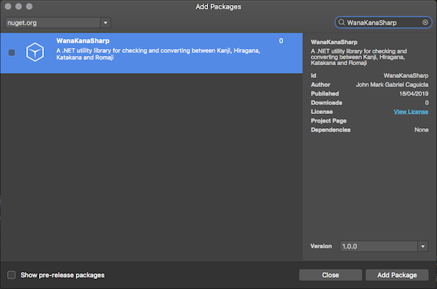

<div align="center">
    <h1>ワナカナ &lt;--&gt; WanaKanaSharp &lt;--&gt; わなかな</h1>
    <h4>A .NET library for checking and converting between Hiragana, Katakana and Romaji</h4>
    <h6>This project is a port of :crocodile: <a href="https://github.com/WaniKani/WanaKana">WanaKana</a> :crab: for the .NET platform</h6>
</div>

## Status

<div align="center">
    <table>
        <tbody align="center">
            <tr>
                <th>
                    <strong width="1000px">Travis CI</strong>
                </th>
                <th>
                    <strong width="1000px">AppVeyor</strong>
                </th>
            </tr>
            <tr>
                <td>
                    <a href="https://travis-ci.org/caguiclajmg/WanaKanaSharp" width="50%">
                        
                    </a>
                </td>
                <td>
                    <a href="https://ci.appveyor.com/project/caguiclajmg/wanakanasharp" width="50%">
                        <div>
                            
                        </div>
                        <div>
                            
                        </div>
                    </a>
                </td>
            </tr>
        </tbody>
    </table>
</div>

> 🚧 **Warning**: Pre-release versions (<1.0) are experimental, expect API breakage!

## Usage

Pre-built packages are available from [NuGet](https://www.nuget.org/packages/WanaKanaSharp/)

### Visual Studio

Search for WanaKanaSharp on NuGet Package Manager



### .NET Core

Navigate to your project's directory and do: `dotnet add package WanaKanaSharp`

## Examples

```cs
    // Utility functions
    Assert.IsTrue(WanaKana.IsRomaji("hello"));
    Assert.IsTrue(WanaKana.IsHiragana("こんにちは"));
    Assert.IsTrue(WanaKana.IsKatakana("テレビ"));
    Assert.IsTrue(WanaKana.IsKana("これはキュートです"));
    Assert.IsTrue(WanaKana.IsKanji("日本語"));

    // Romaji conversion
    RomajiConverter romajiConverter = new HepburnRomajiConverter();
    Assert.AreEqual("hiragana", romajiConverter.ToRomaji("ひらがな", false, null));
    Assert.AreEqual("katakana", romajiConverter.ToRomaji("カタカナ", false, null));
    Assert.AreEqual("今日 ha PAATEI", romajiConverter.ToRomaji("今日 は パーティ", true, null));

    // Kana conversion
    KanaConverter kanaConverter = new DefaultKanaConverter();
    Assert.AreEqual("ひらがな", kanaConverter.ToKana("hiragana", null));
    Assert.AreEqual("カタカナ", kanaConverter.ToKana("KATAKANA", null));
```
